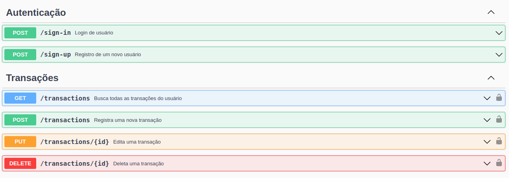

<p align="center"></p>

# <p align = "center">MyWallet</p>

## <p align = "center">API de gerenciamento financeiro pessoal</p>

<div align = "center">
   
   
   
   
   
   
   
   
</div>

$~$

### :clipboard: Descrição

O projeto consiste em uma API desenvolvida em NodeJS, Express e MongoDB, que oferece funcionalidades para gerenciamento de finanças pessoais com segurança e eficiência.

Esta é a parte backend do projeto, incluindo um fluxo de login seguro com criptografia de senhas e token JWT, além de rotas autenticadas para visualizar, registrar, editar e deletar transações.

A aplicação oferece rotas autenticadas para visualizar todas as transações registradas, permitindo que os usuários possam ter uma visão geral de suas finanças, assim como o saldo atual. Além disso, é possível registrar uma nova transação de gasto ou ganho, incluindo informações como data, valor e categoria.

#### 💸 [API](https://mywallet.up.railway.app)

#### 💰 [Aplicação fullstack](https://mywallet-gabrielatiago.vercel.app/)

---

### :bookmark_tabs: Características do projeto

- Fluxo de cadastro e login de usuários
- Criptrografia de senhas
- Autenticação com JWT
- Validações de schemas
- CRUD completo para transações

---

### :rocket: Rodando esse projeto localmente

Para inicializar esse projeto é necessário que você possua a última versão estável do [Node.js](https://nodejs.org/en/download) e [npm](https://www.npmjs.com/) rodando localmente. Você também precisará instalar o [MongoDB](https://www.mongodb.com/docs/manual/installation/) para acessar o banco de dados, deixando aberto durante a execução.

Primeiro de tudo, clone este projeto ou faça o download do ZIP.

Para realizar o clone, no terminal de sua máquina, utilize o [git](https://git-scm.com/) e insira o seguinte comando:

```bash
    https://github.com/GabrielaTiago/MyWallet-back.git
```

Entre na pasta do projeto

```bash
    cd MyWallet-back
```

Execute o seguinte comando para instalar as dependências.

```bash
    npm install
```

Para ininicilizar o banco de dados, execute:

```bash
   mongod --dbpath ~/.mongo
```

🛑 Não feche esse terminal!!

Crie um arquivo **.env** na raíz do projeto com os seguintes dados:

```bash
    PORT=5000
    MONGO_URI="mongodb://127.0.0.1:27017"
    MONGO_DATABASE_NAME="MyWallet"
```

Para iniciar o servidor, execute o comando:

```bash
    npm run start
```

A aplicação estará disponível em: <http://localhost:5000> no seu navegador.

---

### :world_map: Rotas

Para acessar a documentação, implementada com swagger, acesse a rota: **/documentation**

:warning: Todas as rotas **_/transactions_** são **_autenticadas_** e necessitam de um token de acesso

```yml
- headers: { Authorization: `Bearer ${token}` }
```



---

### :bulb: Reconhecimentos

- [Badges para Github](https://github.com/alexandresanlim/Badges4-README.md-Profile#-database-)
- [Inspiração de README](https://gist.github.com/luanalessa/7f98467a5ed62d00dcbde67d4556a1e4#file-readme-md)
- [Driven Education](https://www.driven.com.br)

---

### 👩‍🦱 Autora

Gabriela Tiago de Araújo

- email: gabrielatiagodearaujo@outlook.com
- linkedin: <https://www.linkedin.com/in/gabrielatiago/>
- portfolio: <https://gabrielatiago.vercel.app>

---

[🔝 Back to top](#mywallet)
